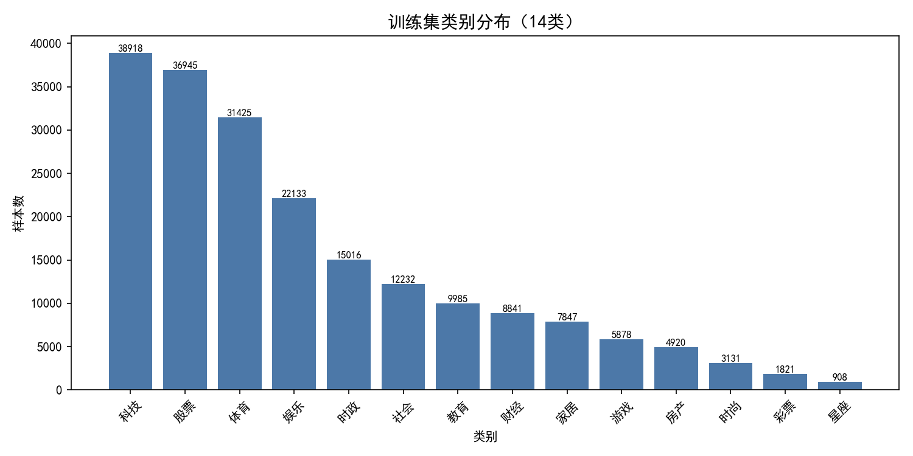
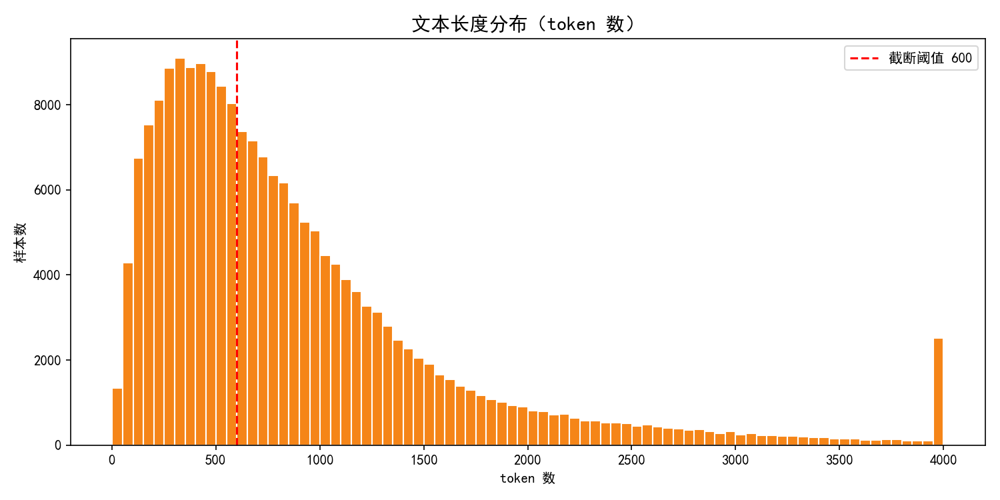
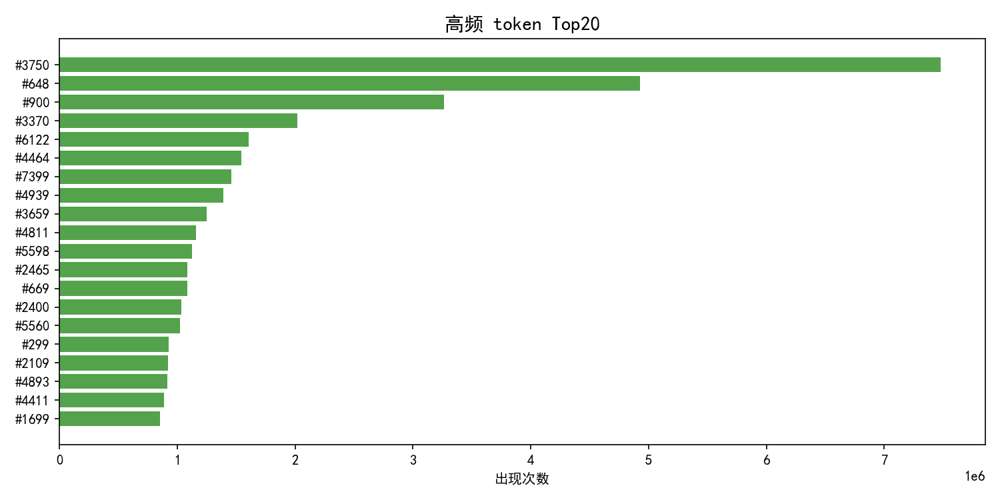

# 数据探索分析（EDA）报告

> 项目：智慧笔迹——NLP 新闻分类学习赛
> 数据：天池「零基础入门 NLP—新闻文本分类」赛题数据

## 1. 数据概览

| 项目 | 说明 |
|------|------|
| 任务类型 | 14 类新闻文本多分类 |
| 训练集 | 200,000 条（`train_set.csv`，列 `label` + `text`） |
| 测试集 A | 50,000 条（`test_a.csv`，列 `text`） |
| 测试集 B | 50,000 条（`test_b.csv`，列 `text`） |
| 分隔符 | `\t` |
| 评测指标 | macro F1（各类别 F1 均值） |
| 数据特点 | 文本按**字符级匿名化**，空格分隔的数字 token |

**标签映射（官方固定）：**

| 类别 | 编号 | 类别 | 编号 |
|------|------|------|------|
| 科技 | 0 | 财经 | 7 |
| 股票 | 1 | 家居 | 8 |
| 体育 | 2 | 游戏 | 9 |
| 娱乐 | 3 | 房产 | 10 |
| 时政 | 4 | 时尚 | 11 |
| 社会 | 5 | 彩票 | 12 |
| 教育 | 6 | 星座 | 13 |

## 2. 类别分布分析

| 统计项 | 结果 |
|--------|------|
| 类别数 | 14 |
| 样本最多类别 | 科技（38,918 条） |
| 样本最少类别 | 星座（908 条） |
| 最大/最小比 | **约 43 : 1** |

**结论**：类别分布严重不均衡。科技、股票、体育等大众新闻类别样本量远大于彩票、星座等小众类别。

**对建模的启示**：
- 由于评测指标是 **macro F1**（各类别 F1 直接平均，与样本量无关），小类别（彩票、星座、时尚）的预测质量与科技、股票**同等重要**。
- 必须采用应对类别不均衡的策略：使用 `StratifiedKFold` 保证每折类别比例一致；损失函数可引入类别权重或 Focal Loss；评估时关注小类别的召回率。

## 3. 文本长度分析

| 统计项 | 结果 |
|--------|------|
| 平均长度 | 907 token |
| 中位数 | 676 token |
| ≤600 token 占比 | 44.5% |
| 最长样本 | 12,211 token |

**结论**：文本长度呈长尾分布，多数样本集中在 1000 token 以内，少数样本极长。

**对建模的启示**：
- 需设置**截断阈值**。本实验取 `MAX_SEQ_LEN = 600`，覆盖约 44.5% 样本的完整内容；其余样本截断后仍保留前部信息（新闻标题/导语通常承载主要主题）。
- 长文本可进一步采用「头尾截断」或「分块池化」策略（BERT 阶段）以保留尾部关键信息。

## 4. 高频 token 分析

| 排名 | token | 出现次数 |
|------|-------|---------|
| 1 | #3750 | 7,482,224 |
| 2 | #648 | 4,924,890 |
| 3 | #900 | 3,262,544 |
| 4 | #3370 | 2,020,958 |
| 5 | #6122 | 1,602,363 |

**结论**：文本被匿名化后，token 是数字编号。排名第一的 `#3750` 出现 748 万次，远超其他 token，很可能对应匿名化前的标点符号或高频停用字（如"的""了"等）。

**对建模的启示**：
- 匿名化使**中文分词、预训练词向量（如中文 BERT 词表）失效**，需在训练集上自训练字符级向量（Word2Vec），或直接用 token ID 作为字符微调预训练模型。
- 高频停用类 token 可考虑过滤，但需注意：匿名化下无法确定其真实语义，过度过滤可能丢失信息，建议保留并由模型学习。

## 5. 总结

1. **数据质量**：20w 训练样本、14 类、格式规范，无缺失、无需清洗脏数据。
2. **两大核心难点**：① 类别严重不均衡（43 倍），叠加 macro F1 指标，小类别成关键；② 字符级匿名化，需自建词向量。
3. **建模方向**：从浅层（TF-IDF + 线性模型）到深度（Word2Vec + TextCNN / BiLSTM / BERT），逐级提升，并针对不均衡与长文本做优化。
